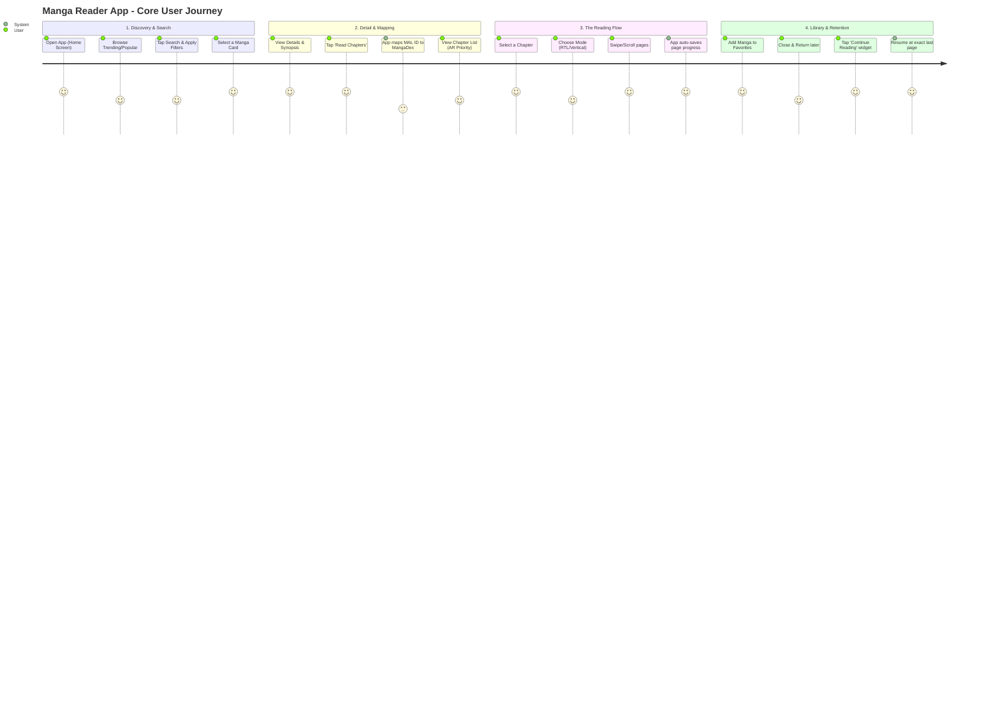

# 02 — UX Flows

### 1. Core UX Flows (Step-by-Step)

**Flow 1: Discovery & Search (Finding Content)**

1. **Launch:** User opens the app and lands on the `Home Screen`.
2. **Browse:** User browses 'Trending' and 'Popular' manga fetched via Jikan API.
3. **Search:** User taps the search icon, inputs a title (e.g., "Solo Leveling"), and applies filters (e.g., Type: Manhwa).
4. **Select:** User taps a specific manga card from the search results to view its details.

**Flow 2: Manga Details & Chapter Mapping (The Bridge)**

1. **View Details:** User lands on the `Detail Screen`, seeing the cover, Arabic/English title, and synopsis.
2. **Action:** User taps the "Read Chapters" (اقرأ الفصول) button.
3. **System Process:** The app silently resolves the MAL ID to a MangaDex UUID (fetching from local cache or API).
4. **View Chapters:** User is presented with the `Chapter List Screen`, where chapters are grouped by number with Arabic translations prioritized and clearly badged.

**Flow 3: The Reading Experience (Core Value)**

1. **Select Chapter:** User taps a chapter from the list.
2. **Reader Initialization:** The `Reader Screen` opens. User selects or defaults to a reading mode (Horizontal RTL for Manga, Vertical Scroll for Manhwa).
3. **Consume:** User swipes/scrolls through pages. The app pre-fetches upcoming images for a seamless experience.
4. **Auto-Save:** As the user reads, the app debounces and saves the current page index and chapter ID to the local database.

**Flow 4: Library & Retention (Coming Back)**

1. **Favorite:** User taps the "Heart" icon on a manga's detail page to add it to their `Favorites Screen`.
2. **Return:** User closes the app and opens it the next day.
3. **Resume:** User sees a "Continue Reading" (متابعة القراءة) widget on the Home/Favorites screen.
4. **Jump Back:** User taps it and is instantly taken to the exact page and chapter they left off at.

---

