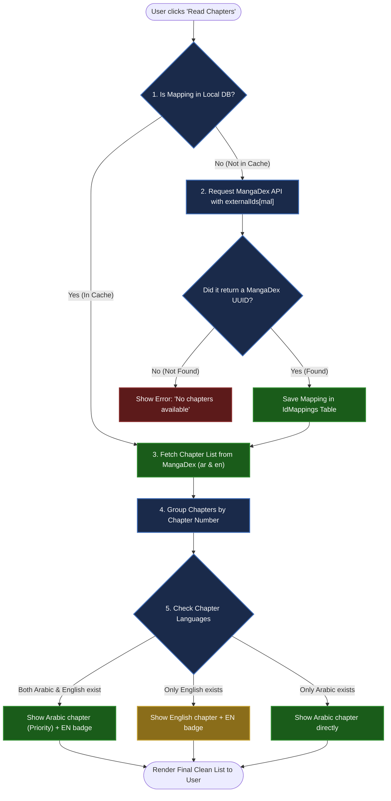
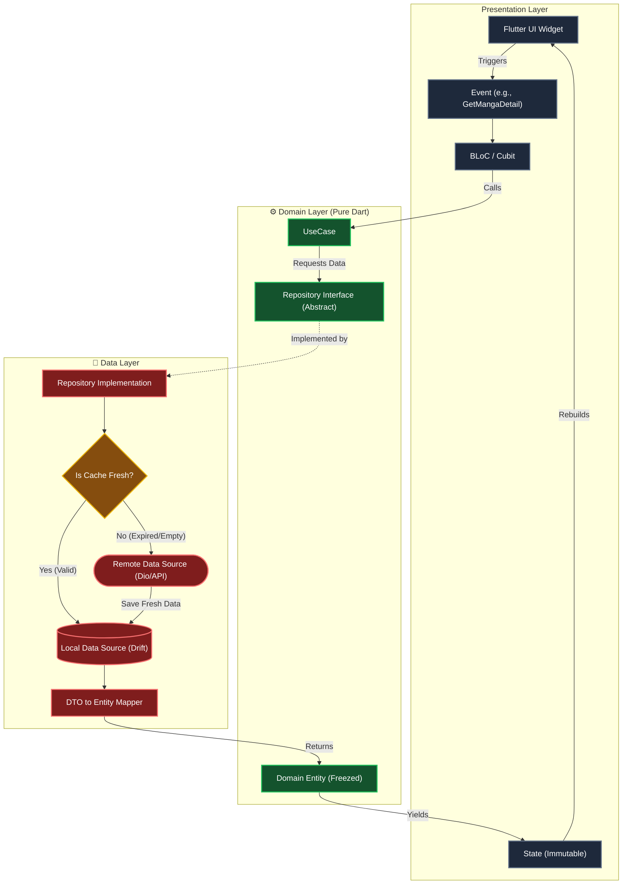
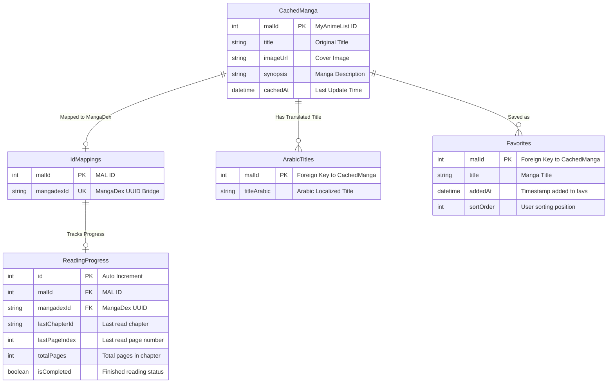

# 03 — Architecture

1. ID Mapping Logic :

```mermaid
graph TD
    %% Styling
    classDef primary fill:#1a2a4a,stroke:#3d6cb8,color:#fff,stroke-width:2px;
    classDef success fill:#1a5c1a,stroke:#2d8a2d,color:#fff,stroke-width:2px;
    classDef warning fill:#8a6d1a,stroke:#c4a032,color:#fff,stroke-width:2px;
    classDef danger fill:#5c1a1a,stroke:#8a2d2d,color:#fff,stroke-width:2px;

    Start([User clicks 'Read Chapters']) --> CheckCache{"1. Is Mapping in Local DB?"}:::primary
    
    %% Cache Hit
    CheckCache -- Yes (In Cache) --> FetchFeed["3. Fetch Chapter List from MangaDex (ar & en)"]:::success
    
    %% Cache Miss
    CheckCache -- No (Not in Cache) --> CallMangaDex["2. Request MangaDex API with externalIds[mal]"]:::primary
    CallMangaDex --> VerifyResponse{"Did it return a MangaDex UUID?"}:::primary
    
    VerifyResponse -- Yes (Found) --> SaveMapping["Save Mapping in IdMappings Table"]:::success
    SaveMapping --> FetchFeed
    
    VerifyResponse -- No (Not Found) --> ShowErrorNoManga["Show Error: 'No chapters available'"]:::danger

    %% Chapter Resolution & Language Logic
    FetchFeed --> GroupChapters["4. Group Chapters by Chapter Number"]:::primary
    GroupChapters --> LoopChapters{"5. Check Chapter Languages"}:::primary
    
    LoopChapters -- Both Arabic & English exist --> SelectArabic["Show Arabic chapter (Priority) + EN badge"]:::success
    LoopChapters -- Only English exists --> SelectEnglish["Show English chapter + EN badge"]:::warning
    LoopChapters -- Only Arabic exists --> ShowArabicOnly["Show Arabic chapter directly"]:::success
    
    SelectArabic --> RenderList([Render Final Clean List to User])
    SelectEnglish --> RenderList
    ShowArabicOnly --> RenderList
```

---

2. Clean Architecture & Data Flow (BLoC) : 

```mermaid
graph TD
    %% Styling based on layers
    classDef presentation fill:#1e293b,stroke:#64748b,stroke-width:2px,color:#fff;
    classDef domain fill:#14532d,stroke:#22c55e,stroke-width:2px,color:#fff;
    classDef data fill:#7f1d1d,stroke:#f87171,stroke-width:2px,color:#fff;
    classDef decision fill:#854d0e,stroke:#eab308,stroke-width:2px,color:#fff;

    subgraph Presentation["Presentation Layer"]
        UI["Flutter UI Widget"]:::presentation
        Event["Event (e.g., GetMangaDetail)"]:::presentation
        Bloc["BLoC / Cubit"]:::presentation
        State["State (Immutable)"]:::presentation
    end

    subgraph Domain["⚙️ Domain Layer (Pure Dart)"]
        UseCase["UseCase"]:::domain
        RepoInterface["Repository Interface (Abstract)"]:::domain
        Entity["Domain Entity (Freezed)"]:::domain
    end

    subgraph Data["💾 Data Layer"]
        RepoImpl["Repository Implementation"]:::data
        CheckCache{"Is Cache Fresh?"}:::decision
        LocalDB[("Local Data Source (Drift)")]:::data
        RemoteAPI(["Remote Data Source (Dio/API)"]):::data
        Mapper["DTO to Entity Mapper"]:::data
    end

    %% The Flow
    UI -->|Triggers| Event
    Event --> Bloc
    Bloc -->|Calls| UseCase
    UseCase -->|Requests Data| RepoInterface
    RepoInterface -.->|Implemented by| RepoImpl
    
    RepoImpl --> CheckCache
    CheckCache -- Yes (Valid) --> LocalDB
    CheckCache -- No (Expired/Empty) --> RemoteAPI
    
    RemoteAPI -->|Save Fresh Data| LocalDB
    LocalDB --> Mapper
    Mapper -->|Returns| Entity
    
    Entity -->|Yields| State
    State -->|Rebuilds| UI
```

---

3. Local Database Schema (ERD) : 

```mermaid
erDiagram
    %% Relationships
    CachedManga ||--o| IdMappings : "Mapped to MangaDex"
    CachedManga ||--o{ ArabicTitles : "Has Translated Title"
    CachedManga ||--o{ Favorites : "Saved as"
    IdMappings ||--o| ReadingProgress : "Tracks Progress"

    %% Tables Definition
    CachedManga {
        int malId PK "MyAnimeList ID"
        string title "Original Title"
        string imageUrl "Cover Image"
        string synopsis "Manga Description"
        datetime cachedAt "Last Update Time"
    }

    Favorites {
        int malId PK "Foreign Key to CachedManga"
        string title "Manga Title"
        datetime addedAt "Timestamp added to favs"
        int sortOrder "User sorting position"
    }

    ArabicTitles {
        int malId PK "Foreign Key to CachedManga"
        string titleArabic "Arabic Localized Title"
    }

    IdMappings {
        int malId PK "MAL ID"
        string mangadexId UK "MangaDex UUID Bridge"
    }

    ReadingProgress {
        int id PK "Auto Increment"
        int malId FK "MAL ID"
        string mangadexId FK "MangaDex UUID"
        string lastChapterId "Last read chapter"
        int lastPageIndex "Last read page number"
        int totalPages "Total pages in chapter"
        boolean isCompleted "Finished reading status"
    }
```